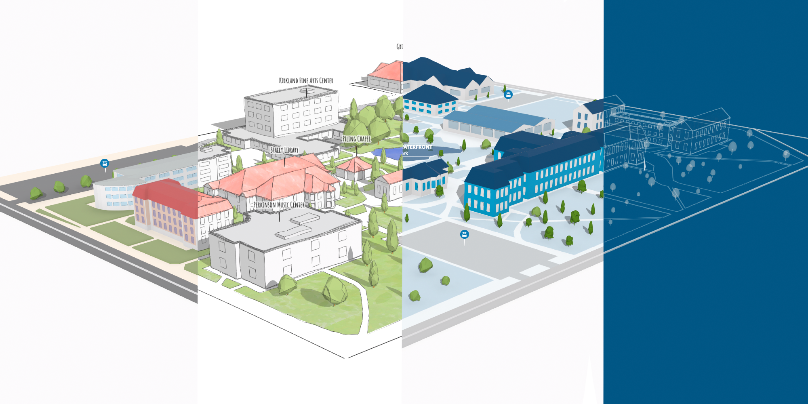
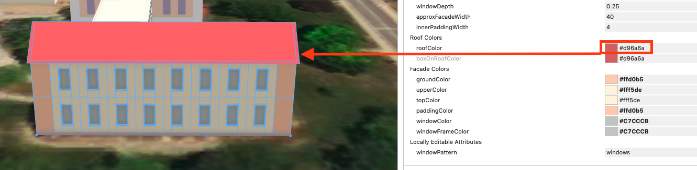
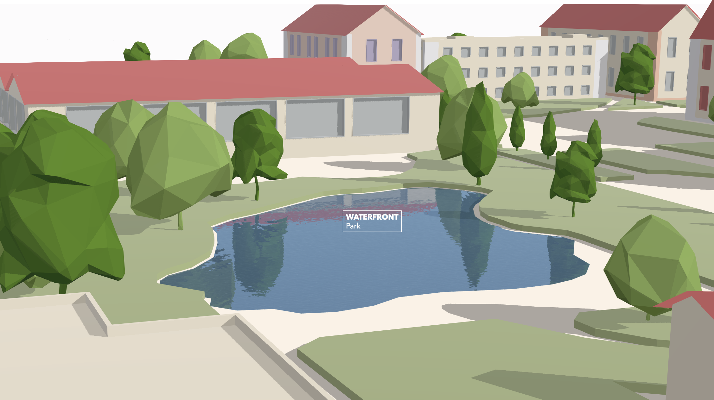

# Campus map styles

[](https://arcg.is/zOnWb)
[Campus styles - story map](https://arcg.is/zOnWb)

[Campus map - classic](https://ralucanicola.github.io/campus-map/classical/)
[Campus map - hand-drawn](https://ralucanicola.github.io/campus-map/hand-drawn/)
[Campus map - branded](https://ralucanicola.github.io/campus-map/branded/)
[Campus map - blueprint](https://ralucanicola.github.io/campus-map/blueprint/)

## Introduction

Campus maps are often a mix of art and practical information: they show where you are and how to get where you want, but they do so with playful or stylish visuals. While looking at various campus maps (I made a [collection of campus maps on Pinterest](https://www.pinterest.ch/ralucagnicola/campus-maps/)), I was inspired to create an interactive 3D web campus map using [CityEngine](https://www.esri.com/en-us/arcgis/products/arcgis-cityengine/overview) and [ArcGIS API for JavaScript](https://developers.arcgis.com/javascript/latest/). In this readme I'll describe the technical details behind this project.

## Workflow

There are 4 styles of maps in this repository, but this workflow focuses only on the classical style. The other styles use a similar approach with small differences.

The steps to create the classical campus map are the following:

1. Generate the buildings in CityEngine
2. Create the basemap using the editor in ArcGIS API for JavaScript
3. Display map in ArcGIS API for JavaScript

### Step 1. Generate the buildings in CityEngine

(in case you already have the 3D geometry for the campus buildings you can skip this step)

The starting point for this are the building footprints. Using the [Get map data](https://doc.arcgis.com/en/cityengine/2019.0/help/cityengine-help-get-map-data.htm) functionality in CityEngine we can download the building footprints for a given extent.

Next we'll write procedural rules to generate the 3D models of the buildings. [Here](./classical/cga-rule/building.cga) you can find the .cga file with the rules for the classical style. The rules are based on a few assumptions that we made for the buildings on this campus:

- The body of the building is created by extruding the footprint to a given height. In some cases the height might be included in the OSM data.
- The floor height is adjustable. Each floor has windows with adjustable width, height and depth. Using local edits on each facade and/or on each floor you can define whether to have single windows, double windows or no windows at all.
- There are four types of roofs that can be applied to a building: a flat roof, a gable roof, a mansard roof, a hip roof and an M shaped roof. A flat roof can have one or more access hatches that are placed randomly. The roof color is adjustable.
- Individual parts of the building can have different colors: the corners, the ground floor, the top floor and the floors in between can all have different colors.

The rule assigns default values for attributes like building height or roof type:

```
attr floorHeight = 4
attr roofColor = "#d96a6a"
attr windowColor = "#c7cccb"
```

However, you can override these attributes manually in the Inspector:


3D model of a building generated using the rules in [building.cga](./classical/cga-rule/building.cga) and the configurable attributes.

After generating the models we export them as slpk and upload them to ArcGIS Online. This will create a scene layer that we can then load in our web application.

### Step 2. Create the basemap using the editor in ArcGIS API for JavaScript

Again, the same disclaimer: in case you already have the data, jump to step 3. I didn't have any data for the campus map, so I digitized it from scratch directly in the 3D web map. There are many ways to create this data, but this is how I did this:

Step 2.1. I created the feature layers in ArcGIS Online using the Create Item option.

Step 2.2. In the Item settings I enabled the Editing capabilities on the layer.

Step 2.3. Add the Editor widget to the application and enable snapping to other features and to perpendicular and parallel directions:

```js
const editor = new Editor({
  view: view,
});
const snappingSources = [{ layer: areasLayer }, { layer: roads }];
editor.viewModel.sketchViewModel.snappingOptions = {
  enabled: true,
  selfEnabled: true,
  featureEnabled: true,
  featureSources: snappingSources,
};
view.ui.add(editor, "top-right");
```

Then I started digitizing the parks, the parking areas, the lake, the roads and the trees. Here are some gifs of what this looks like:


### Step 3. Display map in ArcGIS API for JavaScript

In this step we bring it all together in a 3D web application.

Step 3.1. Create the [webscene](https://developers.arcgis.com/javascript/latest/api-reference/esri-WebScene.html) and the [view](https://developers.arcgis.com/javascript/latest/api-reference/esri-views-SceneView.html):

```js
const webscene = new WebScene({
  ground: {
    surfaceColor: "white",
  },
});

const view = new SceneView({
  container: "viewDiv",
  qualityProfile: "high",
  map: webscene,
  environment: {
    lighting: {
      date: "Mon Feb 15 2021 21:30:00 GMT+0100 (Central European Standard Time)",
      ambientOcclusionEnabled: false,
      directShadowsEnabled: true,
      waterReflectionEnabled: true,
    },
  },
  camera: {
    position: [-88.97955612, 39.83921313, 149.51383],
    heading: 45.34,
    tilt: 70.69,
  },
});
```

Then we start adding the layers and styling each one of them.

Step 3.2. Add buildings as a [SceneLayer](https://developers.arcgis.com/javascript/latest/api-reference/esri-layers-SceneLayer.html) and set the labels and the popup. Notice that we don't set any renderer because the colors were set in CityEngine.

```js
const buildingsLayer = new SceneLayer({
  url: "https://tiles.arcgis.com/tiles/V6ZHFr6zdgNZuVG0/arcgis/rest/services/campus_buildings/SceneServer",
  popupTemplate: {
    title: "",
    content: "Building: {NAME}",
  },
  labelingInfo: [
    new LabelClass({
      labelExpressionInfo: { expression: "$feature.name" },
      symbol: {
        type: "label-3d",
        symbolLayers: [
          {
            type: "text",
            material: {
              color: [50, 50, 50, 1],
            },
            halo: {
              size: 2,
              color: [255, 255, 255, 0.8],
            },
            font: {
              size: 11,
              family: `"Avenir Next","Helvetica Neue",Helvetica,Arial,sans-serif`,
            },
          },
        ],
      },
    }),
  ],
});
```

Step 3.3. Add trees as 3D models in gltf format as an [ObjectSymbol3DLayer](https://developers.arcgis.com/javascript/latest/api-reference/esri-symbols-ObjectSymbol3DLayer.html). Notice the fields "Height" and "Rotation" that drive the height and orientation of the tree model. These fields have random values here. I created these values when I digitized the data by using the editing manipulators to scale and rotate the 3D model.

```js
const treesLayer = new FeatureLayer({
  title: "Trees",
  url: "https://services.arcgis.com/V6ZHFr6zdgNZuVG0/arcgis/rest/services/Campus_features/FeatureServer/0",
  elevationInfo: {
    mode: "absolute-height",
  },
  renderer: {
    type: "unique-value", // autocasts as new UniqueValueRenderer()
    field: "Class",
    visualVariables: [
      {
        // size can be modified with the interactive handle
        type: "size",
        field: "Height",
        axis: "height",
        valueUnit: "meters",
      },
      {
        // rotation can be modified with the interactive handle
        type: "rotation",
        field: "Rotation",
      },
    ],
    uniqueValueInfos: [
      {
        value: "Eucalyptus",
        symbol: {
          type: "point-3d",
          symbolLayers: [
            {
              type: "object",
              resource: { href: "../assets/trees/Blue_Gum_Eucalyptus.glb" },
              material: { color: [86, 140, 10] },
              height: 20,
            },
          ],
        },
      },
      // more values here
    ],
  },
});
```

Step 3.4. Add the areas layer

I used [ExtrudeSymbol3DLayer](https://developers.arcgis.com/javascript/latest/api-reference/esri-symbols-ExtrudeSymbol3DLayer.html) to display polygons for parks and parking lots. The lake is rendered with a [WaterSymbol3DLayer](https://developers.arcgis.com/javascript/latest/api-reference/esri-symbols-WaterSymbol3DLayer.html). Setting a high quality mode on the view and enabling water reflections create a playful game-like effect:



Step 3.5. Add the roads layer

The roads have a multiple symbol layer symbology. We use two 3D path symbol layers to mimic 2 lanes:

```js
const roads = new FeatureLayer({
  url: "https://services.arcgis.com/V6ZHFr6zdgNZuVG0/arcgis/rest/services/Campus_features/FeatureServer/1",
  definitionExpression: "Class='Street'",
  renderer: {
    type: "unique-value",
    field: "Class",
    uniqueValueInfos: [
      {
        value: "Street",
        symbol: {
          type: "line-3d",
          symbolLayers: [
            {
              type: "path",
              profile: "quad",
              material: { color: [150, 150, 150, 1] },
              width: 10,
              height: 0.2,
              join: "miter",
              cap: "butt",
              anchor: "bottom",
              profileRotation: "all",
            },
            {
              type: "path",
              profile: "quad",
              material: { color: [255, 255, 255, 1] },
              width: 1,
              height: 0.4,
              join: "miter",
              cap: "butt",
              anchor: "bottom",
              profileRotation: "all",
            },
          ],
        },
      },
    ],
  },
});
```

And that's all there is to it!
